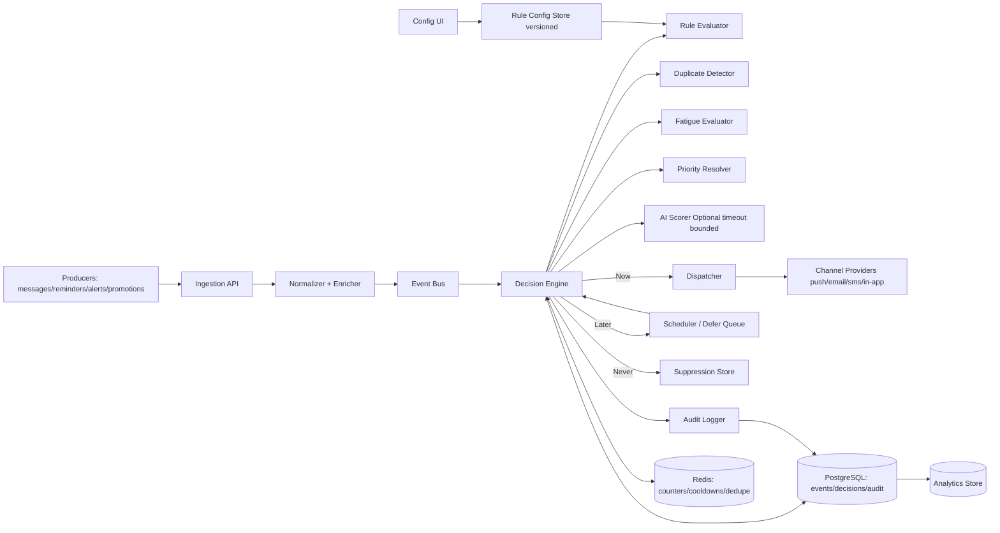

# Cyepro Round 1 - Notification Prioritization Engine

## Problem
Users receive too many notifications across multiple features. The system must decide for each incoming event:
- `Now` (send immediately)
- `Later` (defer/schedule)
- `Never` (suppress)

The design must also prevent duplicates, reduce alert fatigue, remain explainable/auditable, and fail safely if AI/dependencies are unavailable.

## High-Level Architecture

## Data Flow
1. Event arrives at `POST /v1/events/ingest`.
2. Payload is validated, normalized, and assigned `event_id`.
3. Decision Engine runs deterministic rules first, then optional AI scoring with strict timeout.
4. Outcome is one of `Now | Later | Never`.
5. Decision + reasons are persisted in audit tables.
6. Deferred notifications are re-evaluated at scheduled time.

## Decision Strategy (`Now / Later / Never`)
1. Hard checks: invalid schema, expired event, disabled channel => `Never`.
2. Exact dedupe: reliable `dedupe_key` (or deterministic fallback hash) found in TTL window => `Never`.
3. Near dedupe: semantically similar recent message for same user/source => `Later` or `Never`.
4. Priority scoring:
   - Base from `event_type` + `priority_hint`.
   - Urgency boost if near `expires_at`.
5. Alert fatigue penalties:
   - Per-channel cooldown.
   - Per-user caps.
   - Quiet-hour demotion for non-urgent events.
6. Conflict resolution:
   - Critical alerts can bypass selected cooldowns, but with burst guardrails.
7. Final thresholds:
   - score >= `T_now` => `Now`
   - `T_later` <= score < `T_now` => `Later`
   - score < `T_later` => `Never`
8. Attach explainability fields:
   - `reason_codes[]`, `rule_version`, `model_version`, `explanation_text`.

## Minimal Data Model

### `notification_events`
- `event_id` (pk), `user_id`, `event_type`, `source`, `channel`
- `message`, `message_norm_hash`, `priority_hint`
- `dedupe_key`, `timestamp`, `expires_at`, `metadata_json`

### `notification_decisions`
- `decision_id` (pk), `event_id` (fk), `decision`
- `score`, `scheduled_for`, `reason_codes[]`, `explanation_text`
- `rule_version`, `model_version`, `decided_at`

### `user_notification_state`
- `user_id`, `channel`, `window_start`
- `sent_count`, `cooldown_until`, `last_sent_at`

### `defer_queue`
- `event_id`, `user_id`, `scheduled_for`, `status`, `retry_count`

### `suppression_records`
- `event_id`, `suppression_type`, `suppression_reason`, `ttl_end`

### `rule_configs`
- `rule_id`, `version`, `condition_json`, `action_json`
- `enabled`, `updated_by`, `updated_at`

## API Contracts (3-5 Endpoints)
1. `POST /v1/events/ingest`
   - Validates and persists event.
   - Returns `event_id`.
2. `POST /v1/decisions/evaluate`
   - Evaluates one event (or inline payload).
   - Returns `decision`, `scheduled_for`, `reason_codes`, `explanation`.
3. `POST /v1/dispatch/send`
   - Sends `Now` events to channel providers.
4. `POST /v1/rules/validate-and-publish`
   - Validates and publishes human-edited rule set with versioning.
5. `GET /v1/audit/events/{event_id}`
   - Full traceability: all checks, thresholds, and fallback path.

## Duplicate Prevention
- Exact duplicates:
  - Use `dedupe_key` when present.
  - Fallback hash: `user_id + event_type + source + channel + message_hash + time_bucket`.
  - Redis `SETNX` with TTL for low-latency suppression.
- Near duplicates:
  - Normalize title/message, generate semantic fingerprint (SimHash/MinHash).
  - If similarity > threshold in short window, defer/suppress based on priority.
- Cross-service burst dedupe:
  - Merge related low-priority events into one digest notification.

## Alert Fatigue Strategy
- Dynamic cooldown per user/channel (`N` max notifications per window).
- Priority lanes:
  - Critical lane: limited bypass.
  - Normal/promotional lane: strict caps and quiet-hour deferral.
- Digest batching for low-value or promotional events.
- Channel adaptation: if push is noisy, shift non-urgent to in-app digest.

## Fallback and Reliability
- AI scorer has strict timeout (example: 50ms budget inside 120ms p95 decision SLO).
- If AI/dependency fails:
  - fallback to deterministic rules only
  - never block ingestion
  - queue and retry downstream dispatch
- Important notifications are never silently dropped:
  - if send fails, move to retry queue / DLQ with alerting.
- Circuit breaker for unstable dependencies.

## Metrics and Monitoring
- Throughput: events/min, decisions/min, sends/min.
- Latency: p50/p95/p99 decision time.
- Outcome distribution: `%Now`, `%Later`, `%Never`.
- Suppression quality: exact-vs-near dedupe rates.
- Fatigue outcomes: avg notifications/user/day, cap-hit rate.
- Reliability: queue lag, retry counts, DLQ size, dependency timeout rate.
- Audit coverage: `% decisions with reason_codes and explanation`.

## Tradeoff Notes
- Deterministic rules run first for predictable low-latency behavior.
- AI is additive, not mandatory, to keep system safe under failures.
- Deferral is preferred over suppression for ambiguous non-critical events.
- Versioned configuration enables non-developer policy changes with auditability.

## Submission Assets in This Folder
- `README.md` (this file)
- `samples/01_ingest_event.json`
- `samples/02_decision_response_now.json`
- `samples/03_decision_response_later.json`
- `samples/04_decision_response_never.json`
- `samples/05_audit_event_response.json`

## AI Usage Disclosure (for submission email/video)
I used AI assistance for structuring architecture options, endpoint naming, and failure-mode checklists. I manually refined the scoring flow, fallback behavior, data model fields, and audit/reason-code design for practical implementation.
